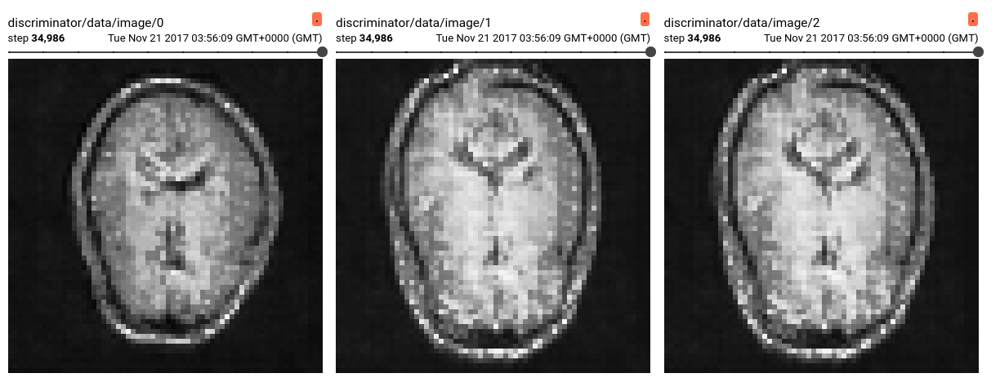
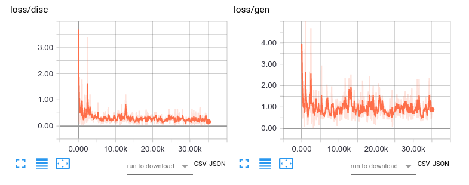

## Generative modeling of 3T T1 brain MR images
Exemplary training script for generative modeling of T1w brain MR images, based on the [IXI dataset](http://brain-development.org/ixi-dataset/) [1]. We are using a custom DCGAN-like [2] architecture.

[1] IXI – Information eXtraction from Images (EPSRC GR/S21533/02)  
[2] Radford et al. Unsupervised representation learning with deep convolutional generative adversarial networks. 2015



### Data
The data can be downloaded via the script in dltk/data/IXI_HH. It includes 178 datasets and corresponding demographic information. The download script
 - produces a CSV file containing demographic information
 - validates the completeness of all imaging data for each database entry
 - resamples the images to 1mm isotropic resolution
 - removes .tar files and original images

demographic_HH.csv:
```
IXI_ID,"SEX_ID (1=m, 2=f)",HEIGHT,WEIGHT,ETHNIC_ID,MARITAL_ID,OCCUPATION_ID,QUALIFICATION_ID,DOB,DATE_AVAILABLE,STUDY_DATE,AGE
IXI012,1,175,70,1,2,1,5,1966-08-20,1,2005-06-01,38.7816563997
IXI013,1,182,70,1,2,1,5,1958-09-15,1,2005-06-01,46.7104722793
...
```

In `train.py`, the CSV is parsed. A custom `reader.py` extracts tf.Tensor examples for trainingin using a [SimpleITK](http://www.simpleitk.org/) for  i/o of the .nii files:

```
...
t1 = sitk.GetArrayFromImage(sitk.ReadImage(t1_fn))
...
```

### Usage
- You can download a pre-trained model for fine-tuning or deployment [here](http://www.doc.ic.ac.uk/~mrajchl/dltk_models/examples/applications/IXI_HH_DCGAN.tar.gz). 
The archive contains both the tf.estimator export folder and the standard 
.index, .meta and .data-* files for continuing training. Extract the model 
folder from the .tar.gz file and point your ```--model_path``` MY_MODEL_PATH 
argument to its location (see below). 

- To train a new model, run the train.py script. Display run options with
  ``` python train.py --help ```:  

  ```
  usage: train.py [-h] [--run_validation RUN_VALIDATION] [--restart] [--verbose]
                    [--cuda_devices CUDA_DEVICES] [--model_path MODEL_PATH]
                    [--data_csv DATA_CSV]  
  ``` 
  
  To start training, run the training script with the desired options:  

  ```
  python train.py MY_OPTIONS
  ```
  
  

  The model and training events will be saved to a ```model_path``` 
  MY_MODEL_PATH.
  
- For monitoring and metric tracking, spawn a tensorboard webserver and point
 the log directory to MY_MODEL_PATH:

  ```
  tensorboard --logdir MY_MODEL_PATH
  ```
  
  
  