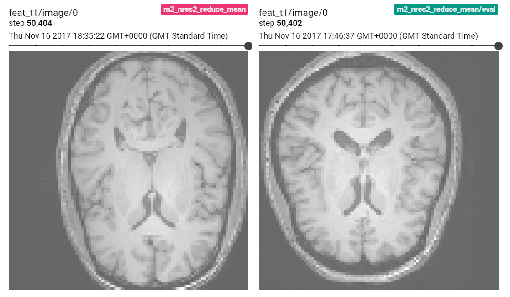
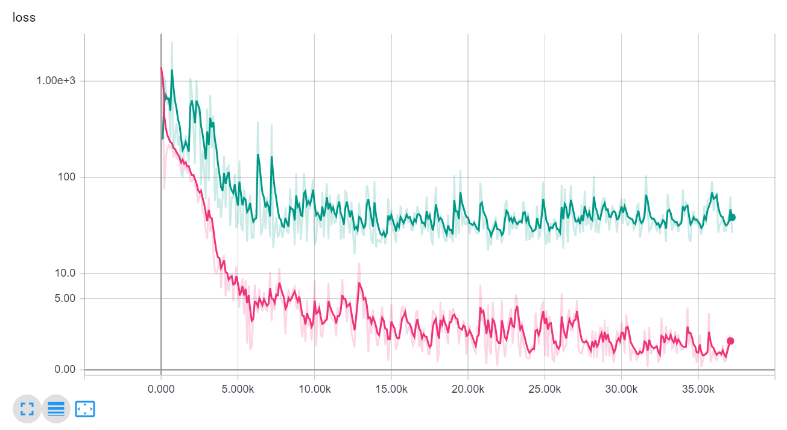
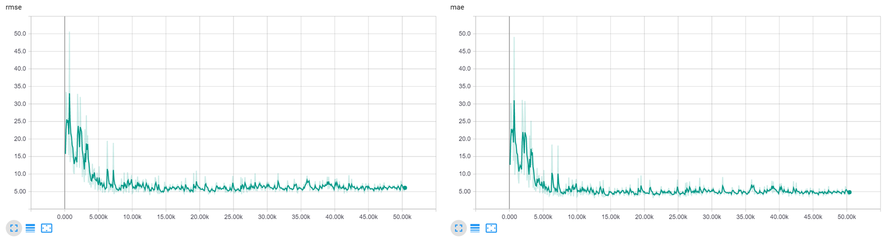

## Age regression from 3T T1w brain MR images
Exemplary training and evaluation scripts for regression from T1w brain MR images, based on the [IXI dataset](http://brain-development.org/ixi-dataset/) [1]. 

[1] IXI – Information eXtraction from Images (EPSRC GR/S21533/02)



### Data
The data can be downloaded via the script in dltk/data/IXI_HH. It includes 178 datasets and corresponding demographic information. The download script
 - produces a CSV file containing demographic information
 - validates the completeness of all imaging data for each database entry
 - resamples the images to 1mm isotropic resolution
 - removes .tar files and original images

demographic_HH.csv:
```
IXI_ID,"SEX_ID (1=m, 2=f)",HEIGHT,WEIGHT,ETHNIC_ID,MARITAL_ID,OCCUPATION_ID,QUALIFICATION_ID,DOB,DATE_AVAILABLE,STUDY_DATE,AGE
IXI012,1,175,70,1,2,1,5,1966-08-20,1,2005-06-01,38.7816563997
IXI013,1,182,70,1,2,1,5,1958-09-15,1,2005-06-01,46.7104722793
...
```

In `train.py`, the CSV is parsed and split into a training and validation set. A custom `reader.py` extracts tf.Tensor examples for training and evaluation in using a [SimpleITK](http://www.simpleitk.org/) for  i/o of the .nii files:

```
...
t1 = sitk.GetArrayFromImage(sitk.ReadImage(t1_fn))
t2 = sitk.GetArrayFromImage(sitk.ReadImage(t2_fn))
pd = sitk.GetArrayFromImage(sitk.ReadImage(pd_fn))
...
```

### Notes 
In this example we use the first 150 datasets for training, the rest for validation. Here are some quick statistics on the sets:

| AGE   | mean  | sd    | min   | max   |
|-------|-------|-------|-------|-------|
| all   | 47.35 | 16.76 | 20.17 | 81.94 |
| train | 48.00 | 17.14 | 20.17 | 81.94 |
| val   | 43.89 | 14.02 | 25.53 | 71.21 |


### Usage
- You can download a pre-trained model for fine-tuning or deployment [here](http://www.doc.ic.ac.uk/~mrajchl/dltk_models/examples/applications/IXI_HH_age_regression.tar.gz). 
The archive contains both the tf.estimator export folder and the standard 
.index, .meta and .data-* files for continuing training. Extract the model 
folder from the .tar.gz file and point your ```--model_path``` MY_MODEL_PATH 
argument to its location (see below). 

- To train a new model, run the train.py script. Display run options with
  ``` python train.py --help ```:  

  ```
  usage: train.py [-h] [--run_validation RUN_VALIDATION] [--restart] [--verbose]
                    [--cuda_devices CUDA_DEVICES] [--model_path MODEL_PATH]
                    [--data_csv DATA_CSV]  
  ``` 
  
  To start training, run the training script with the desired options:  

  ```
  python train.py MY_OPTIONS
  ```

  The model and training events will be saved to a ```model_path``` 
  MY_MODEL_PATH:   
  
  

- For monitoring and metric tracking, spawn a tensorboard webserver and point
 the log directory to MY_MODEL_PATH:

  ```
  tensorboard --logdir MY_MODEL_PATH
  ```
  
   
  
- To deploy a model and run inference, run the deploy.py script and point to 
the trained model:

  ```
  python -u deploy.py --model_path MY_MODEL_PATH
  ```
  
  Note that during deploy we average the predictions of 4 random crops of a test input, so results may vary a bit from run to run. The expected output of deploy should look similar to the one below: 
  
  ```
  id=IXI566; pred=47.20 yrs; true=42.97 yrs; run time=1.75 s;   
  id=IXI567; pred=33.68 yrs; true=28.56 yrs; run time=0.32 s; 
  ...
  mean absolute err=5.399 yrs
  ```
   


