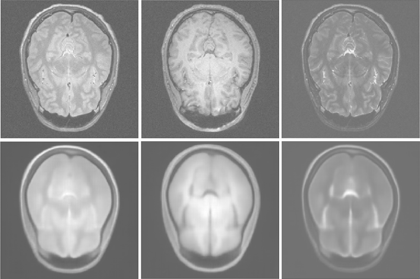
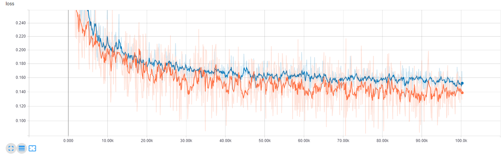

## Representation learning on 3T multi-channel brain MR images
Exemplary training and evaluation scripts for representation learning from multi-sequence (T1w, T2w, PD) brain MR images, based on the [IXI dataset](http://brain-development.org/ixi-dataset/) [1]. 

[1] IXI – Information eXtraction from Images (EPSRC GR/S21533/02)



### Data
The data can be downloaded via the script in dltk/data/IXI_HH. It includes 178 datasets and corresponding demographic information. The download script
 - produces a CSV file containing demographic information
 - validates the completeness of all imaging data for each database entry
 - resamples the images to 1mm isotropic resolution
 - removes .tar files and original images

demographic_HH.csv:
```
IXI_ID,"SEX_ID (1=m, 2=f)",HEIGHT,WEIGHT,ETHNIC_ID,MARITAL_ID,OCCUPATION_ID,QUALIFICATION_ID,DOB,DATE_AVAILABLE,STUDY_DATE,AGE
IXI012,1,175,70,1,2,1,5,1966-08-20,1,2005-06-01,38.7816563997
IXI013,1,182,70,1,2,1,5,1958-09-15,1,2005-06-01,46.7104722793
...
```

In `train.py`, the CSV is parsed and split into a training and validation set. A custom `reader.py` extracts tf.Tensor examples for training and evaluation in using a [SimpleITK](http://www.simpleitk.org/) for  i/o of the .nii files:

```
...
t1 = sitk.GetArrayFromImage(sitk.ReadImage(t1_fn))
t2 = sitk.GetArrayFromImage(sitk.ReadImage(t2_fn))
pd = sitk.GetArrayFromImage(sitk.ReadImage(pd_fn))
...
```

### Training


To train a new model, run the train.py script:

  ```
  python -u train.py MY_OPTIONS
  ```

### Monitoring

For monitoring and metric tracking, spawn a tensorboard webserver and point the log directory to the model_path:

  ```
  tensorboard --logdir /tmp/IXI_autoencoder/
  ```
  
### Deploy

To deploy a model and run inference, run the deploy.py script and point to the model_path:

  ```
  python -u deploy.py --model_path /tmp/IXI_autoencoder MY_OPTIONS
  ```
