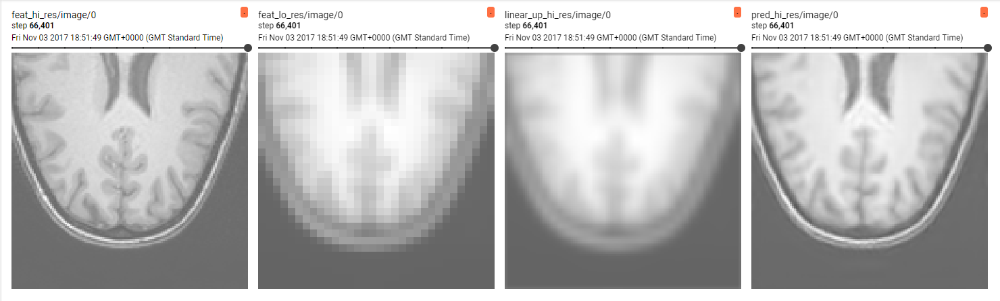
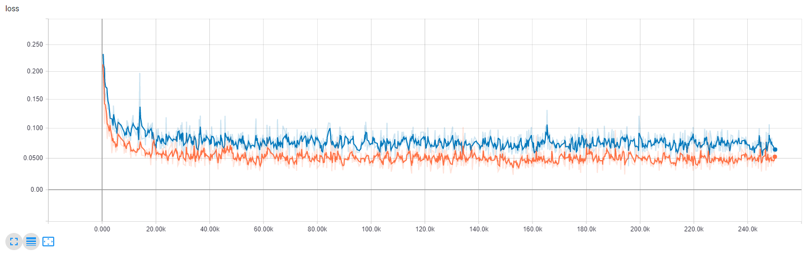

## Simple image super-resolution on T1w brain MR images
Exemplary training scripts for image super-resolution from T1w brain MR images, based on the [IXI dataset](http://brain-development.org/ixi-dataset/) [1]. 

[1] IXI – Information eXtraction from Images (EPSRC GR/S21533/02)



### Important Notes 
The artificial downsampling is done via an average pooling op with a kernel size twice of the upsampling factor. This is just to showcase how to the set up works and currently the network learns the inverse of that downsampling op. In practice, this should be replaced by a proper downsampling strategy. For comparison, we also provide results of ```dltk.core.upsampling.linear_upsample_3D```, which exists only for comparison and adds an unnecessary computational burden in practice.  

### Data
The data can be downloaded via the script in $DLTK_SRC/data/IXI_HH/. It includes 177 datasets and corresponding demographic information. The download script
 - produces a CSV file containing demographic information
 - validates the completeness of all imaging data for each database entry
 - resamples the images to 1mm isotropic resolution
 - removes .tar files and original images

demographic_HH.csv:
```IXI_ID,"SEX_ID (1=m, 2=f)",HEIGHT,WEIGHT,ETHNIC_ID,MARITAL_ID,OCCUPATION_ID,QUALIFICATION_ID,DOB,DATE_AVAILABLE,STUDY_DATE,AGE
IXI012,1,175,70,1,2,1,5,1966-08-20,1,2005-06-01,38.7816563997
IXI013,1,182,70,1,2,1,5,1958-09-15,1,2005-06-01,46.7104722793
...
```

In `train.py`, the CSV is parsed and split into a training and validation set. A custom `reader.py` extracts tf.Tensor examples for training and evaluation in using a [SimpleITK](http://www.simpleitk.org/) for  i/o of the .nii files:

```...
t1 = sitk.GetArrayFromImage(sitk.ReadImage(t1_fn))
...

```

### Training


To train a new model, run the train.py script:

  ```python -u train.py $MY_OPTIONS```

### Monitoring

For monitoring and metric tracking, spawn a tensorboard webserver and point the log directory to the model save_path:

  ```tensorboard --logdir=$MY_SAVE_PATH```
  
### Deploy

To deploy a model and run inference, run the deploy.py script and point to the model save_path:

  ```python -u deploy.py --save_path $MY_SAVE_PATH  $MY_OPTIONS```