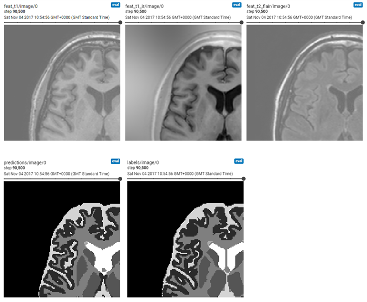
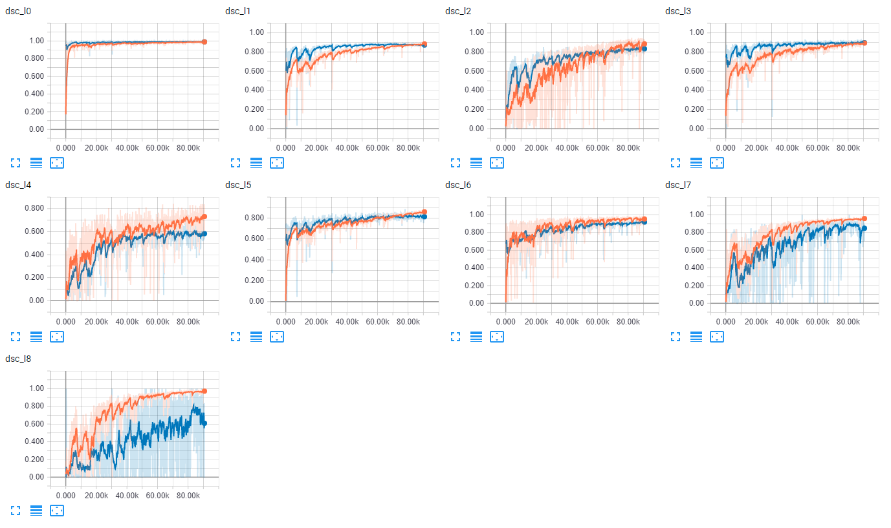

## Image segmentation of multi-channel brain MR images
Exemplary training scripts for tissue segmentation from multi-sequence (T1w, T1 inversion recovery, T2 Flair) brain MR images, based on the [MRBrainS13](http://mrbrains13.isi.uu.nl/) challenge data [1]. 

[1] AM Mendrik et al, (2015). MRBrainS challenge: online evaluation framework for brain image segmentation in 3T MRI scans. Computational intelligence and neuroscience.



### Data
The data can be downloaded [here](http://mrbrains13.isi.uu.nl/download.php) and requires registration. It includes 5 datasets and corresponding segmentations. CSV files contain the paths to the folders for the training and validation splits, respectively:

mrbrains.csv:
```
id, subj_folder
1, MY_DATA_PATH/MRBrainS13DataNii/TrainingData/1/
2, MY_DATA_PATH/MRBrainS13DataNii/TrainingData/2/
3, MY_DATA_PATH/MRBrainS13DataNii/TrainingData/3/
4, MY_DATA_PATH/MRBrainS13DataNii/TrainingData/4/
5, MY_DATA_PATH/MRBrainS13DataNii/TrainingData/5/
```

These are parsed and extract tf.Tensor examples for training and evaluation in `reader.py` using a [SimpleITK](http://www.simpleitk.org/) for i/o of the .nii files:

```
...
t1 = sitk.GetArrayFromImage(sitk.ReadImage(os.path.join(str(img_fn), 'T1.nii')))
t1_ir = sitk.GetArrayFromImage(sitk.ReadImage(os.path.join(str(img_fn), 'T1_IR.nii')))
...
```


### Usage
- You can download a pre-trained model for fine-tuning or deployment [here](http://www.doc.ic.ac.uk/~mrajchl/dltk_models/examples/applications/MRBrainS13_tissue_segmentation.tar.gz). 
The archive contains both the tf.estimator export folder and the standard 
.index, .meta and .data-* files for continuing training. Extract the model 
folder from the .tar.gz file and point your ```--model_path``` MY_MODEL_PATH 
argument to its location (see below). 

- To train a new model, run the train.py script. Display run options with
  ``` python train.py --help ```:  

  ```
  usage: train.py [-h] [--run_validation RUN_VALIDATION] [--restart] [--verbose]
                    [--cuda_devices CUDA_DEVICES] [--model_path MODEL_PATH]
                    [--data_csv DATA_CSV]  
  ``` 
  
  To start training, run the training script with the desired options:  

  ```
  python train.py MY_OPTIONS
  ```

  The model and training events will be saved to a ```model_path``` 
  MY_MODEL_PATH.   
  

- For monitoring and metric tracking, spawn a tensorboard webserver and point
 the log directory to MY_MODEL_PATH:

  ```
  tensorboard --logdir MY_MODEL_PATH
  ```
  
  
  
- To deploy a model and run inference, run the deploy.py script and point to 
the trained model:

  ```
  python -u deploy.py --model_path MY_MODEL_PATH
  ```
